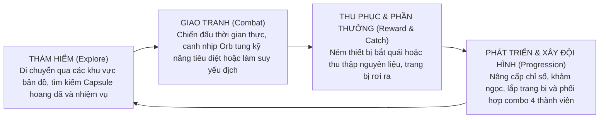
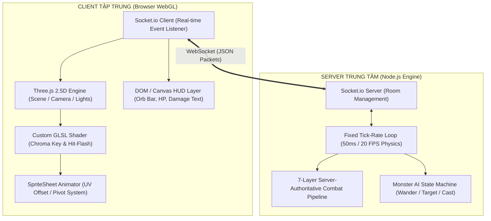

# 📖 TÀI LIỆU THIẾT KẾ TRÒ CHƠI TOÀN DIỆN (GAME DESIGN DOCUMENT - GDD)
## DỰ ÁN: LEGEND OF CAPSULES (2.5D ACTION RPG)
> **Mã dự án:** `legend-of-capsules`  
> **Phiên bản tài liệu:** 2.0 (Bản chuẩn hóa chuyên nghiệp ngành Game)  
> **Tài liệu tham chiếu:** [https://github.com/Newwyn/Game](https://github.com/Newwyn/Game)  
> **Dành cho:** Ban điều hành dự án, Đội ngũ Lập trình (Frontend/Backend), Họa sĩ (2D/VFX) và Game Designer

---

## 📌 MỤC LỤC
1. [BẢNG THÔNG TIN DỰ ÁN (PROJECT ONE-PAGER)](#1-bảng-thông-tin-dự-án-project-one-pager)
2. [TỔNG QUAN & TRỤ CỘT THIẾT KẾ (CORE PILLARS & HIGH CONCEPT)](#2-tổng-quan--trụ-cột-thiết-kế-core-pillars--high-concept)
3. [VÒNG LẶP TRÒ CHƠI CỐT LÕI (CORE GAMEPLAY LOOP)](#3-vòng-lặp-trò-chơi-cốt-lõi-core-gameplay-loop)
4. [HỆ THỐNG CHIẾN ĐẤU & CƠ CHẾ SÁT THƯƠNG (COMBAT & STAT ENGINE)](#4-hệ-thống-chiến-đấu--cơ-chế-sát-thương-combat--stat-engine)
5. [THIẾT KẾ NHÂN VẬT & QUÁI VẬT (CLASSES & CREATURES)](#5-thiết-kế-nhân-vật--quái-vật-classes--creatures)
6. [KIẾN TRÚC KỸ THUẬT & ĐỒ HỌA (TECHNICAL DESIGN & VISUAL SHADERS)](#6-kiến-trúc-kỹ-thuật--đồ-họa-technical-design--visual-shaders)
7. [HỆ THỐNG GIAO DIỆN & ÂM THANH (UI/UX & AUDIO DESIGN)](#7-hệ-thống-giao-diện--âm-thanh-uiux--audio-design)
8. [LỘ TRÌNH SẢN XUẤT & PHÂN BỔ NHIỆM VỤ (ROADMAP & PRODUCTION MILESTONES)](#8-lộ-trình-sản-xuất--phân-bổ-nhiệm-vụ-roadmap--production-milestones)

---

## 1. BẢNG THÔNG TIN DỰ ÁN (PROJECT ONE-PAGER)

| Hạng mục | Chi tiết |
| :--- | :--- |
| **Tên trò chơi** | **Legend of Capsules** |
| **Thể loại (Genre)** | 2.5D Real-Time Action RPG / Creature Battler |
| **Góc nhìn (Perspective)** | 2.5D Isometric / Fixed Orbit Camera (Nhân vật Sprite 2D trong không gian 3D) |
| **Nền tảng (Platform)** | Web-first (HTML5 / WebGL), hỗ trợ Desktop & Mobile qua trình duyệt; mở rộng sang Mobile/PC qua WebView/Electron |
| **Mô hình kinh doanh** | Free-to-Play (F2P) kết hợp vật phẩm trang trí, hệ thống mở gói sinh vật (Capsule Summon) và gói thám hiểm (Battle Pass) |
| **Đối tượng mục tiêu** | Người chơi yêu thích dòng game nhập vai hành động nhịp độ cao, phong cách hoạt họa dễ thương, tính chiến thuật đội hình sâu và khả năng kết nối nhiều người chơi tức thời |

---

## 2. TỔNG QUAN & TRỤ CỘT THIẾT KẾ (CORE PILLARS & HIGH CONCEPT)

### 2.1 Định vị ý tưởng (High Concept)
**Legend of Capsules** mang đến trải nghiệm nhập vai trực tuyến đa người chơi, nơi game thủ thu thập, huấn luyện và điều khiển đội hình các sinh vật dạng khối nhộng (Capsule Creatures) bước vào các trận chiến thời gian thực nghẹt thở. Điểm độc đáo của trò chơi nằm ở sự kết hợp giữa nét nghệ thuật hoạt ảnh 2D vẽ tay truyền thống lướt nhẹ trên không gian 3D sống động, kết hợp hệ thống năng lượng và chiến thuật tung kỹ năng có chiều sâu.

### 2.2 Ba Trụ Cột Thiết Kế (Core Pillars)

```
                     ┌─────────────────────────────────────────────────┐
                     │          LEGEND OF CAPSULES CORE DESIGN         │
                     └────────────────────────┬────────────────────────┘
                                              │
         ┌────────────────────────────────────┼────────────────────────────────────┐
         ▼                                    ▼                                    ▼
┌──────────────────┐               ┌──────────────────┐               ┌──────────────────┐
│   TRỤ CỘT 1:     │               │   TRỤ CỘT 2:     │               │   TRỤ CỘT 3:     │
│  THỊ GIÁC 2.5D   │               │ HÀNH ĐỘNG REAL-  │               │ THU THẬP & THÁM  │
│    ISOMETRIC     │               │  TIME CÓ LỰC     │               │ HIỂM BÁN MỞ      │
└────────┬─────────┘               └────────┬─────────┘               └────────┬─────────┘
         │                                  │                                  │
  • Nhân vật 2D Sprite               • Tích lũy năng lượng              • Thuần hóa sinh vật
  • Môi trường 3D đa chiều            để tung chuỗi kỹ năng              Capsule hoang dã
  • Tối ưu mượt mà WebGL             • Hit-Frame Damage                 • Tương khắc hệ nguyên tố
  • Phong cách cách điệu             • Hit-Flash & Camera Shake         • Bản đồ mở kết nối
```

1. **Trụ cột 1 - Thị giác 2.5D Isometric phong cách (Stylized 2.5D Visuals):**
   - Sự hòa quyện giữa nhân vật dạng Sprite 2D hoạt họa (luôn quay mặt về phía máy quay theo cơ chế Billboard) và địa hình không gian 3D đa chiều.
   - Góc nhìn camera Isometric có kiểm soát mang lại cảm giác thân quen, dễ quan sát toàn cục trận đấu nhưng vẫn phô diễn được chiều sâu phối cảnh.
2. **Trụ cột 2 - Chiến đấu Hành động Thời gian thực có Chiều sâu (Dynamic Real-Time Combat):**
   - Loại bỏ lối đánh theo lượt (turn-based) truyền thống; toàn bộ diễn biến xảy ra liên tục theo thời gian thực.
   - Hệ thống quản lý năng lượng dạng khối (Orb/Energy System): Đòn đánh thường nạp năng lượng $\rightarrow$ người chơi tính toán thời điểm bấm nút thi triển chuỗi chiêu thức phối hợp (Combo Linking).
   - Cảm giác lực đòn đánh (Game Feel): Tích hợp độ trễ vung đòn (Hit-Frame Sync), rung chấn màn hình (Camera Shake), nhấp nháy va chạm (Hit-Flash) và âm thanh phản hồi tần số cao.
3. **Trụ cột 3 - Thu thập Sinh vật & Thám hiểm Thế giới (Creature Collection & World Exploration):**
   - Hệ thống sinh vật phong phú với hệ thống nguyên tố tương sinh tương khắc.
   - Khám phá các vùng đất mở, tìm kiếm quái vật quý hiếm, hạ máu và sử dụng thiết bị thu phục để mở rộng bộ sưu tập đội hình.

---

## 3. VÒNG LẶP TRÒ CHƠI CỐT LÕI (CORE GAMEPLAY LOOP)

Mọi hoạt động của người chơi đều vận hành xoay quanh vòng lặp 4 bước khép kín:



---

## 4. HỆ THỐNG CHIẾN ĐẤU & CƠ CHẾ SÁT THƯƠNG (COMBAT & STAT ENGINE)

### 4.1 Quy trình Xử lý Sát thương 7 Lớp (7-Layer Damage Pipeline)
Mọi đòn tấn công trong game được tính toán nghiêm ngặt tại Máy chủ (Server-Authoritative) qua 7 bước:

```
[1. Xác định Loại Sát Thương] ──> [2. Kiểm tra Né Tránh (Dodge vs Accuracy)]
                                                  │
                                            (Trúng đòn)
                                                  │
[4. Kiểm tra Bạo Kích] <────── [3. Tính Sát Thương Gốc (Base ATK x Skill Multiplier)]
         │
  (Có Crit / Không Crit)
         │
         ▼
[5. Kiểm tra Đỡ Đòn (Block)] ──> [6. Giảm trừ Kháng Giáp (Mitigation Formula)]
                                                  │
                                                  ▼
                                 [7. Áp dụng Hiệu ứng Trạng thái & Xuất Sát thương Cuối]
```

- **Công thức Giảm trừ Giáp (Damage Reduction - DR):**
  $$\text{Mitigation} = \frac{\text{Effective DEF}}{\text{Effective DEF} + 300}$$
  *Trong đó: $\text{Effective DEF} = \text{DEF} \times (1 - \text{Penetration Rate})$.*
- **Công thức Bạo kích (Critical Strike):**
  $$\text{Damage}_{\text{Crit}} = \text{Damage} \times \left(2.0 + \frac{\text{Crit Damage Rating}}{1000}\right)$$
- **Công thức Đỡ đòn (Block):**
  Khi kích hoạt Đỡ đòn thành công (chỉ áp dụng khi đòn đánh không bạo kích), lượng sát thương nhận vào tự động giảm đi **50%**.

### 4.2 Hệ thống 14 Chỉ số Chuẩn hóa (Standardized 1000-Point Rating)
Các thuộc tính phụ đều quy đổi về hệ chuẩn 1000 điểm tương đương $100\%$:
- **Chỉ số Sinh tồn:** Máu tối đa (`maxHp`), Giáp vật lý (`pDef`), Giáp phép thuật (`mDef`).
- **Chỉ số Tấn công:** Công vật lý (`pAtk`), Công phép thuật (`mAtk`), Tốc độ ra đòn (`atkSpeed`), Tầm đánh (`atkRange`).
- **Chỉ số Chiến thuật:** Tỷ lệ bạo kích (`crit`), Sát thương bạo kích cộng thêm (`critDmg`), Xuyên giáp (`pen`), Chính xác (`acc`), Né tránh (`dodge`), Đỡ đòn (`block`), Hút máu (`lifesteal`).
- **Chỉ số Năng lượng:** Năng lượng hồi theo đòn đánh (`mpAtk`), Năng lượng tự hồi mỗi giây (`mpSec`).

### 4.3 Cơ chế Năng lượng Khối (Orb System)
- $1000\text{ MP} = 1\text{ Orb}$.
- Thanh năng lượng tối đa tích trữ được 5 Orbs.
- Mỗi kỹ năng yêu cầu từ 1 đến 3 Orbs để kích hoạt, người chơi phải cân đối giữa việc xả chiêu nhỏ hồi nhanh hay tích trữ cho chiêu tối thượng.

---

## 5. THIẾT KẾ NHÂN VẬT & QUÁI VẬT (CLASSES & CREATURES)

### 5.1 Lớp Nhân vật Tiêu biểu: Sát Thủ (Assassin 🥷)
- **Đặc trưng:** Cận chiến vật lý cơ động, sát thương bạo kích cao, khai thác điểm mù sau lưng và cơ chế tàng hình.
- **Bộ Kỹ năng Chủ động:**
  1. **Phi Tiêu (Shuriken Throw):** Tiêu hao 1 Orb | Hồi chiêu 7s. Phóng phi tiêu tầm xa gây $150\%$ sát thương và khắc **Ấn Chiếu (Seal)** lên mục tiêu (giảm $10\%$ Giáp đối phương trong 6s). *Nếu thi triển khi đang Tàng Hình, nhân vật sẽ phóng 2 phi tiêu liên hoàn.*
  2. **Đột Kích (Shadow Dash):** Tiêu hao 2 Orbs | Hồi chiêu 7s. Lướt xuyên qua mục tiêu gây $250\%$ sát thương. *Nếu trên đấu trường có bất kỳ kẻ địch nào đang chịu Ấn Chiếu, sát thủ sẽ lướt chuỗi (Chain Dash) liên hoàn qua tất cả các mục tiêu đó.*
  3. **Tàng Hình (Stealth Veil):** Tiêu hao 3 Orbs | Hồi chiêu 10s. Biến mất khỏi tầm chọn mục tiêu của toàn bộ kẻ địch, đồng thời nhận bùa lợi $+10\%$ Công vật lý và $+10\%$ Tốc độ đánh.
- **Kỹ năng Bị động - Đánh Lén (Backstab Mastery):** Đòn đánh từ phía sau lưng đối thủ được tăng thêm $+50\%$ tỷ lệ Bạo kích.

### 5.2 Phân loại Đối thủ & Quái vật (Monster Archetypes)
1. **Thiết Vệ (Guardian Tanker 🛡️):** Sinh lực dồi dào, giáp cao, sở hữu tỷ lệ đỡ đòn $40\%$. Luôn tiến lên tuyến đầu thu hút hỏa lực để bảo vệ tuyến sau.
2. **Xạ Thủ Tầm Xa (Marksman Archer 🏹):** Tầm bắn 10 ô, sở hữu chỉ số xuyên giáp $30\%$. Đứng ở cự ly an toàn liên tục xả sát thương vật lý.
3. **Phù Thủy Hỗ Trợ (Mystic Supporter 🪄):** Sử dụng sát thương phép thuật, khả năng hồi phục năng lượng vượt trội, chuyên buff giáp và hồi máu cho đội ngũ.
4. **Bù Nhìn Luyện Tập (Practice Dummy 🪵):** Mục tiêu bất tử chuyên dụng để người chơi và đội ngũ kiểm tra chỉ số DPS, thời gian hồi chiêu và tính chính xác của chuỗi combo.

---

## 6. KIẾN TRÚC KỸ THUẬT & ĐỒ HỌA (TECHNICAL DESIGN & VISUAL SHADERS)

### 6.1 Mô hình Tổng thể Client - Server



### 6.2 Giải pháp Đồ họa Độc quyền (Visual Engineering)
1. **GPU Chroma Keying Shader:** Thay vì xử lý cắt phông ảnh nặng nề trên CPU, bộ đổ bóng GLSL tùy biến tự động loại bỏ màu nền Magenta tím (`#FF00FF`) trực tiếp trên card đồ họa với độ mượt khử răng cưa cao.
2. **Khử Viền Pixel (0.001 UV Inset Stabilization):** Thu nhỏ nhẹ nhàng tọa độ UV của từng khung hình để loại bỏ triệt để hiện tượng lem màu viền và giật hình khi camera di chuyển hoặc phóng to thu nhỏ.
3. **Hệ thống Tâm Xoay Động (Row-based Pivot Offset):** Định vị tọa độ tiếp xúc mặt đất độc lập cho từng hàng cử động (Đứng yên, Chạy, Vung kiếm, Xuất chiêu), triệt tiêu hoàn toàn hiện tượng trượt chân nhân vật.

---

## 7. HỆ THỐNG GIAO DIỆN & ÂM THANH (UI/UX & AUDIO DESIGN)

### 7.1 Giao diện Trận Đấu (HUD)
- **Thanh Khối Năng Lượng (Orb Gauge):** Nằm chính giữa bên dưới màn hình, hiển thị trực quan các viên ngọc phát sáng khi tích đủ $1000\text{ MP}$.
- **Hàng Kỹ Năng Thông Minh:** Biểu tượng kỹ năng hiển thị lớp phủ đếm ngược thời gian hồi (Cooldown Overlay), số lượng Orb tiêu hao và hiệu ứng phát sáng khi đủ điều kiện kích hoạt.
- **Hệ thống Xếp Hàng Chiêu Thức (Skill Queue System):** Cho phép người chơi bấm chọn trước kỹ năng; khi đủ năng lượng hoặc hết hoạt ảnh vung tay, chiêu thức sẽ tự động xuất kích không độ trễ.
- **Màn hình Kết Thúc Trận Đấu:** Hộp thoại thông báo Chiến Thắng / Thất Bại hiện đại, trang bị nút **"Thử Lại Trận Này"** tức thì kèm phím tắt bàn phím (`Space` / `Enter` / `R`).

### 7.2 Thiết kế Âm thanh Tương tác (Web Audio Synthesizer)
Tích hợp Web Audio API trực tiếp vào trình duyệt, tự động tổng hợp âm thanh va chạm đòn đánh, tiếng kích hoạt kỹ năng và tiếng phản hồi giao diện không phụ thuộc vào việc phải tải trước các file âm thanh nặng.

---

## 8. LỘ TRÌNH SẢN XUẤT & PHÂN BỔ NHIỆM VỤ (ROADMAP & PRODUCTION MILESTONES)

```
[Milestone 1: Đấu trường Cốt lõi] ──> [Milestone 2: Trang bị & Bản đồ] ──> [Milestone 3: Đội hình & Bắt Thú] ──> [Milestone 4: Bản Beta MMO]
        (ĐÃ HOÀN THÀNH)                      (GIAI ĐOẠN HIỆN TẠI)                   (KẾ HOẠCH BƯỚC TỚI)                (PHÁT HÀNH THỬ NGHIỆM)
```

### ✅ Milestone 1: Đấu trường Cốt lõi & Shader Engine (Hoàn thành)
- Hoàn thiện Engine chiến đấu thời gian thực 2.5D trên nền WebGL.
- Tích hợp nhân vật Sát Thủ đầy đủ hoạt ảnh và Custom Chroma Key Shader.
- Xây dựng hệ thống quái vật AI thử nghiệm và đường ống tính toán sát thương 7 lớp.
- Hoàn thiện cơ chế hồi sinh và khởi động lại trận đấu không độ trễ.

### 🎯 Milestone 2: Hệ thống Trang bị & Bản đồ Thám hiểm (Giai đoạn tiếp theo)
- **Hệ thống 4 Ô Trang bị:** Vũ khí, Áo giáp, Dây chuyền/Trang sức, Quả cầu Hộ mệnh.
- **Bản đồ Thám hiểm 2.5D:** Xây dựng thế giới nhỏ kết nối giữa Làng mạc và Rừng rậm, chuyển cảnh mượt mà vào chế độ thi đấu khi chạm trán quái vật.
- **Chuẩn hóa Đồ họa Quái vật:** Vẽ và tích hợp Spritesheet chuyển động mượt mà cho Thiết Vệ, Xạ Thủ và Phù Thủy Hỗ Trợ.

### 🚀 Milestone 3: Bắt Sinh vật & Điều khiển Đội hình 4 Thành viên
- Thiết bị ném bóng thu phục Capsule khi lượng máu mục tiêu xuống dưới $30\%$.
- Cơ chế quản lý túi đồ và luân chuyển điều khiển 4 nhân vật trong cùng trận đấu.

### 🌟 Milestone 4: Máy chủ Đa người chơi MMO & Lưu trữ Dữ liệu
- Tích hợp cơ sở dữ liệu (Database) lưu trữ tài khoản, bảng xếp hạng và kho đồ cá nhân.
- Hệ thống phòng chơi phân nhánh nhiều bản đồ đồng thời (Room Instancing).

---

### 📋 BẢNG PHÂN CÔNG NHIỆM VỤ ĐỘI NGŨ (TEAM MATRIX)

| Vị trí (Role) | Chuyên trách kỹ thuật | Ưu tiên công việc ngay lúc này |
| :--- | :--- | :--- |
| **Frontend 3D Engineer** | Three.js, Shaders, Canvas UI | • Xây dựng giao diện Hòm đồ (Inventory) 4 slot trang bị.<br>• Tích hợp camera chuyển cảnh mượt giữa Map khám phá và Đấu trường. |
| **Backend Engineer** | Node.js, WebSockets, Logic game | • Xây dựng cấu trúc dữ liệu Trang bị và hàm cộng chỉ số vào 14 Stat.<br>• Nâng cấp hệ thống Room để hỗ trợ nhiều phòng đấu cùng lúc. |
| **Game Designer (GD)** | Cân bằng chỉ số, Thiết kế nội dung | • Thiết kế thông số bảng đồ rơi (Drop Table) và bảng chỉ số Trang bị.<br>• Viết kịch bản bộ kỹ năng cho lớp nhân vật thứ hai (Pháp Sư / Đấu Sĩ). |
| **2D / Pixel Animator** | Spritesheet, UI Assets, VFX | • Cung cấp bộ cử động cho Quái Thiết Vệ và Xạ Thủ.<br>• Vẽ bộ Icon kỹ năng và Icon trang bị theo định dạng Pixel Art sắc nét. |

---
*Tài liệu được lưu trữ và cập nhật liên tục tại kho mã nguồn dự án: `DOCUMENTATION.md`.*
